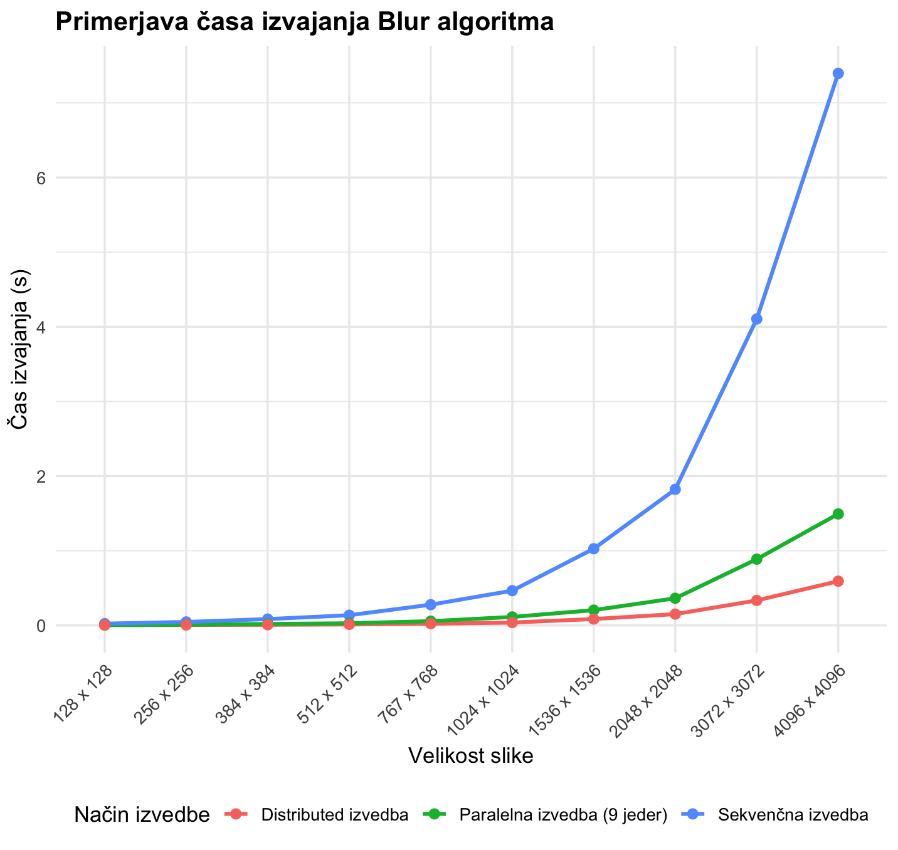
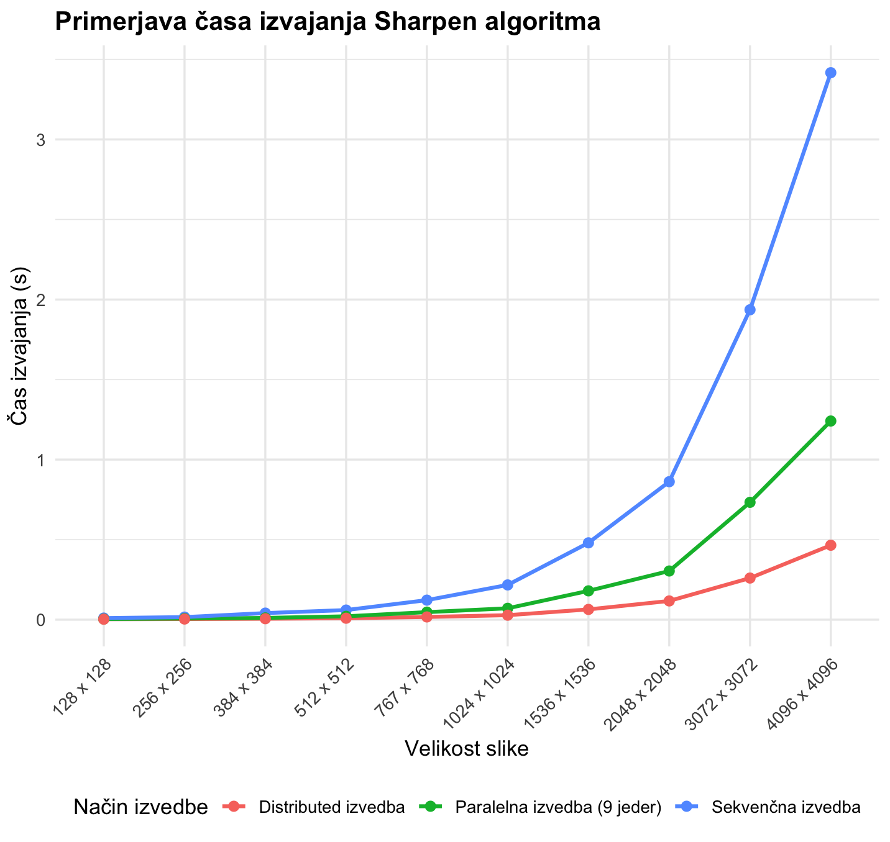
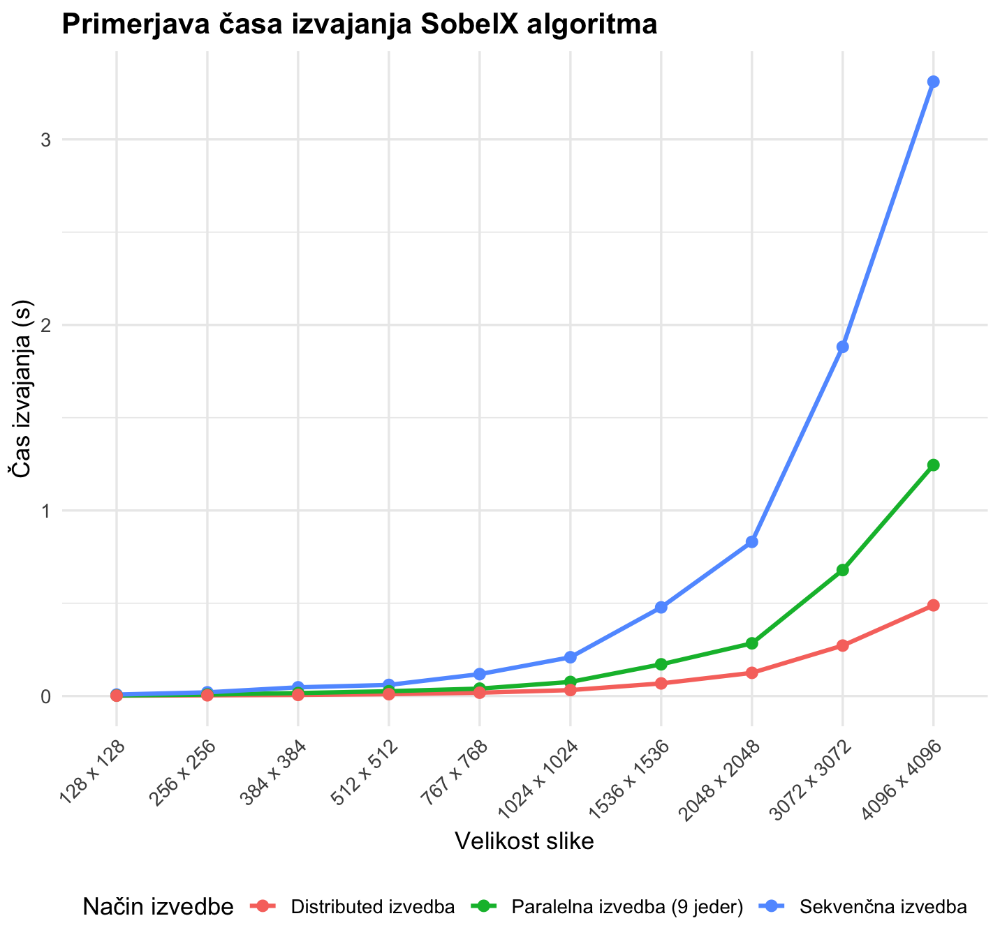
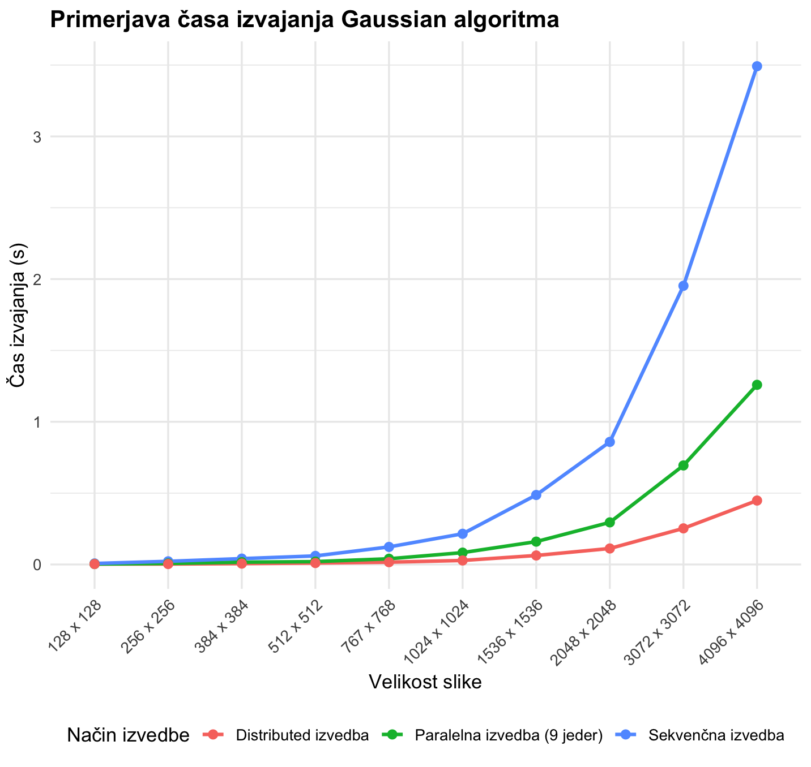
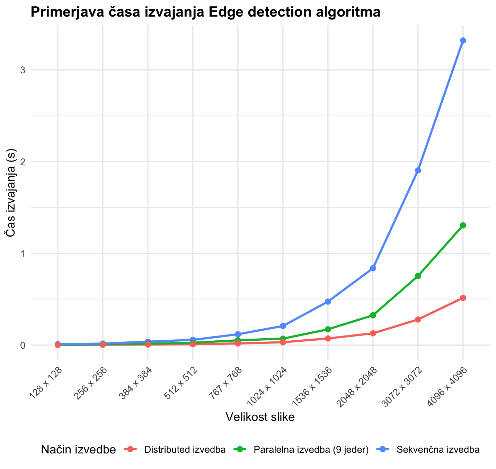

# 🖼️  Kernel Image Processing (Sekvenčna izvedba)

Kernel image processing je temeljna tehnika računalniškega vida, kjer sliko obdelamo tako, da čez njo “drsi” majhen filter (kernel) in na vsakem pikslu izračuna novo vrednost na podlagi pikslov ki so okoli njega - v njegovi okolici. To je osnova za ogromno realnih funkcij: zamegljevanje - blur(odstranjevanje šuma), ostrenje - sharpen (poudarjanje detajlov), zaznavanje robov (npr. Sobel/edge detection), izboljšanje kontrasta in pripravo slike za nadaljnjo analizo. Ker so kerneli hitri, predvidljivi in dobro delujejo na različnih tipih slik, se uporabljajo praktično povsod — od kamer na telefonih in Instagram/CapCut filtrov, do medicinskega slikanja, industrijske kontrole kakovosti, OCR/scan izboljšav, pa tudi kot “prvi korak” v pipeline-u za bolj napredne metode, kot so modeli za prepoznavanje objektov in segmentacijo.

## 🧩 Kaj program dela?
Mi kot uporabnik programa damo programu eno ali več slik svojih poljubnih slik (lahko izbiramo tudi med slikami, ki so prednaložene že v programu). Nato izberemo katero oziroma katere operacije želimo da se izvedejo na vsaki od izbranih slik. Lahko izberemo eno operacijo lahko jih izberemo več. In potem program na vsaki od teh slik izvede izbrane operacije.

## ⚙️ Algoritem za konvolucijo

1. Prebere velikost kernela.
2. Preveri, da ima kernel sredino.
3. Izračunaj polmer kernela.
4. Ustvari novo prazno sliko primerne velikosti.
5. Za vsak piksel slike:
   - Pripravi vsote za `R`, `G` in `B`.
   - Za vsak element kernela:
     - izračunaj koordinato sosednjega piksla,
     - če greš izven slike, uporabi robni piksel,
     - preberi RGB vrednosti soseda,
     - preberi utež iz kernela,
     - RGB vrednosti pomnoži z utežjo,
     - prištej rezultat v vsote.
   - Zaokroži `R`, `G` in `B`.
   - Omeji `R`, `G` in `B` med `0` in `255`.
   - Sestavi nov `ARGB` piksel.
   - Zapiši piksel v novo sliko.
6. Vrni novo sliko.

## 🧪 Primeri uporabe (Use Case)

### 1. Primer uporabe
- Izberemo sliko `2048x2048-Slika.jpg`. 
- Izberemo operacije blur in mirror. (v konzoli se nam izpiše vrstni red operacij) - v tem vrstnem redu se bodo izvedle. 
- Kliknemo gumb `Obdelaj izbrano sliko` 
- V mapi `ustvarjene slike` se nam pojavi rezultat
- V konzoli pa tudi lahko vidimo katere operacije so se zgodile na kateri sliki, v kakšnem vrstnem redu, in tudi koliko je program potreboval da je naredil vse operacije nad izbranimi slikami!

### 2. Primer uporabe
- Izberemo sliko `2048x2048-Slika.jpg`
- Izberemo operacije; blur, edge detection in sharpen (v konzoli se nam izpiše vrstni red operacij) - v tem vrstnem redu se bodo izvedle. 
- Kliknemo gumb `Obdelaj izbrano sliko` 
- V mapi `ustvarjene slike` se nam pojavi rezultat
- V konzoli pa tudi lahko vidimo katere operacije so se zgodile na kateri sliki, v kakšnem vrstnem redu, in tudi koliko je program potreboval da je naredil vse operacije nad izbranimi slikami!

### 3. Primer uporabe
- Izberemo operacije; blur, edge detection in sharpen (v konzoli se nam izpiše vrstni red operacij) - v tem vrstnem redu se bodo izvedle. 
- Kliknemo gumb `Obdelaj mapo slik` in izberemo mapo v kateri so neke slike
- Izberemo to mapo in 
- V mapi `ustvarjene slike` se nam pojavi rezultat (za vsako od teh slik se je naredila sekvenca izbranih operacij)
- V konzoli pa tudi lahko vidimo katere operacije so se zgodile na kateri sliki, v kakšnem vrstnem redu, in tudi koliko je program potreboval da je naredil vse operacije nad izbranimi slikami!

## 🚩 Navodila za zagon programa

1. Če programa še nimaš lokalno ga namestiš s komando:
` git clone https://github.com/Zankooo/Kernel-Image-Sequential.git `
2. Program zaženeš tako da zaženeš Main.java in mora delovati. Pri implementaciji sem uporabljal `open jdk-24.0.2` vendar bi program moral delovati tudi na drugih verzijah Jave. 

## 📝 Opombe
- V celotnem `README.md` ne omenjam da izvedemo konvolucije ampak operacije. To pa zato ker blur, edge detection... že res so konvolucije ampak mirror ne moremo šteti kot konvolucijo ampak je bolj transformacija. 
- Če izberemo tudi operacijo Mirror se bo Mirror operacija vedno zadnja izvedla! Sekvenca operacij (ena za drugo v izbranem vrstnem redu) šteje le za konvolucije. Medtem ko se, če izberemo mirror, zvede vedno zadnja. 

## 🏁 Testiranje
Testiranje sem opravil na svojem osebnem računalniku:
MacBook Pro M1 Max 64Gb/2Tb. 

Pri vseh treh verzijah programa (sekvenčni, vzporedni in porazdeljeni) sem (bom) opravil testiranje na popolnoma istih slikah na popolnoma identičnih operacijah. 

### Testing Table

| Blur                   | Sekvenčna izvedba    | Paralelna izvedba (9 jeder)   | Distributed izvedba |
|------------------------|----------------------|-------------------------------|---------------------|
| 128 x 128 Slika        | 0,023 sec            | 0,004 sec                        | 0,004 sec |
| 256 x 256 Slika        | 0,046 sec            | 0,008 sec                       | 0,006 sec |
| 384 x 384 Slika        | 0,084 sec            | 0,019 sec                      | 0,008 sec |
| 512 x 512 Slika        | 0,136 sec            | 0,028 sec                      | 0,013 sec |
| 767 x 768 Slika        | 0,277 sec            | 0,056 sec                       | 0,022 sec |
| 1024 x 1024 Slika      | 0,465 sec            | 0,113 sec                        | 0,038 sec |
| 1536 x 1536 Slika      | 1,027 sec            | 0,204 sec                        | 0,085 sec |
| 2048 x 2048 Slika      | 1,822 sec            | 0,363 sec                        | 0,151 sec |
| 3072 x 3072 Slika      | 4,105 sec            | 0,887 sec                        | 0,334 sec|
| 4096 x 4096 Slika      | 7,395 sec            | 1,493 sec                         | 0,592 sec|

 

 

| Sharpen                | Sekvenčna izvedba    | Paralelna izvedba (9 jeder) | Distributed izvedba |
|------------------------|----------------------|---------------------|---------------------|
| 128 x 128 Slika        | 0,01 sec             | 0,004 sec           | 0,003 sec|
| 256 x 256 Slika        | 0,016 sec            | 0,007 sec           | 0,004 sec|
| 384 x 384 Slika        | 0,041 sec            | 0,011 sec           | 0,006 sec|
| 512 x 512 Slika        | 0,06 sec             | 0,021 sec           | 0,009 sec|
| 767 x 768 Slika        | 0,122 sec            | 0,047 sec           | 0,017 sec|
| 1024 x 1024 Slika      | 0,217 sec            | 0,071 sec           | 0,028 sec|
| 1536 x 1536 Slika      | 0,48 sec             | 0,18 sec            | 0,064 sec|
| 2048 x 2048 Slika      | 0,862 sec            | 0,304 sec           | 0,117 sec|
| 3072 x 3072 Slika      | 1,936 sec            | 0,733 sec           | 0,260 sec|
| 4096 x 4096 Slika      | 3,417 sec            | 1,241 sec           | 0,465 sec|

 

 

|  SobelX                | Sekvenčna izvedba    | Paralelna izvedba (9 jeder)  | Distributed izvedba |
|------------------------|----------------------|---------------------|---------------------|
| 128 x 128 Slika        | 0,008 sec            | 0,003 sec           | 0,002 sec |
| 256 x 256 Slika        | 0,02 sec             | 0,008 sec           | 0,004 sec|
| 384 x 384 Slika        | 0,047 sec            | 0,016 sec           | 0,006 sec|
| 512 x 512 Slika        | 0,06 sec             | 0,026 sec           | 0,010 sec|
| 767 x 768 Slika        | 0,118 sec            | 0,04 sec            | 0,018 sec|
| 1024 x 1024 Slika      | 0,209 sec            | 0,076 sec           | 0,032 sec |
| 1536 x 1536 Slika      | 0,478 sec            | 0,171 sec           | 0,068 sec|
| 2048 x 2048 Slika      | 0,831 sec            | 0,284 sec           | 0,125 sec|
| 3072 x 3072 Slika      | 1,882 sec            | 0,679 sec           | 0,272 sec|
| 4096 x 4096 Slika      | 3,311 sec            | 1,245 sec           | 0,489 sec|

 

 

| Gaussian               | Sekvenčna izvedba    | Paralelna izvedba (9 jeder)  | Distributed izvedba |
|------------------------|----------------------|---------------------|---------------------|
| 128 x 128 Slika        | 0,007 sec            | 0,003 sec           | 0,003 sec|
| 256 x 256 Slika        | 0,022 sec            | 0,007 sec           | 0,003 sec|
| 384 x 384 Slika        | 0,041 sec            | 0,016 sec           | 0,006 sec|
| 512 x 512 Slika        | 0,06 sec             | 0,02 sec            | 0,010 sec|
| 767 x 768 Slika        | 0,123 sec            | 0,04 sec            | 0,016 sec|
| 1024 x 1024 Slika      | 0,215 sec            | 0,083 sec           | 0,028 sec|
| 1536 x 1536 Slika      | 0,487 sec            | 0,16 sec            | 0,063 sec|
| 2048 x 2048 Slika      | 0,859 sec            | 0,295 sec           | 0,112 sec|
| 3072 x 3072 Slika      | 1,953 sec            | 0,694 sec           | 0,253 sec|
| 4096 x 4096 Slika      | 3,492 sec            | 1,259 sec           | 0,448 sec|

 

 

| Edge detection         | Sekvenčna izvedba    | Paralelna izvedba (9 jeder)  | Distributed izvedba |
|------------------------|----------------------|---------------------|---------------------|
| 128 x 128 Slika        | 0,009 sec            | 0,003 sec           | 0,002 sec|
| 256 x 256 Slika        | 0,016 sec            | 0,008 sec           | 0,004 sec|
| 384 x 384 Slika        | 0,037 sec            | 0,015 sec           | 0,006 sec|
| 512 x 512 Slika        | 0,057 sec            | 0,025 sec           | 0,009 sec|
| 767 x 768 Slika        | 0,118 sec            | 0,052 sec           | 0,018 sec|
| 1024 x 1024 Slika      | 0,208 sec            | 0,07 sec            | 0,031 sec|
| 1536 x 1536 Slika      | 0,474 sec            | 0,172 sec           | 0,072 sec|
| 2048 x 2048 Slika      | 0,838 sec            | 0,325 sec           | 0,128 sec|
| 3072 x 3072 Slika      | 1,904 sec            | 0,753 sec           | 0,279 sec|
| 4096 x 4096 Slika      | 3,320 sec            | 1,305 sec           | 0,515 sec |

 

 

| Mirror                   | Sekvenčna izvedba      | Paralelna izvedba (9 jeder)   |
|------------------------|--------------------------|---------------------
| 128 x 128 Slika        | 0,001 sec  | 0,004 sec   | 
| 256 x 256 Slika        | 0,004 sec  | 0,008 sec   | 
| 384 x 384 Slika        | 0,005 sec  | 0,006 sec   | 
| 512 x 512 Slika        | 0,011 sec  | 0,009 sec   | 
| 767 x 768 Slika        | 0,017 sec  | 0,016 sec   | 
| 1024 x 1024 Slika      | 0,028 sec  | 0,027 sec   | 
| 1536 x 1536 Slika      | 0,061 sec  | 0,062 sec   | 
| 2048 x 2048 Slika      | 0,111 sec  | 0,112 sec   | 
| 3072 x 3072 Slika      | 0,249 sec  | 0,249 sec   | 
| 4096 x 4096 Slika      | 0,449 sec  | 0,446 sec   | 

## ⚡ Izboljšane oziroma drugačne verzije programa

Ta program je implementiran sekvenčno. 
Glede na njegovo strukturo nam daje možnost da ga optimiziramo. 
Optimizirani verziji `vzporedna (paralelna)` in `porazdeljena (distributed)` bosta na voljo kmalu... Coming soon

